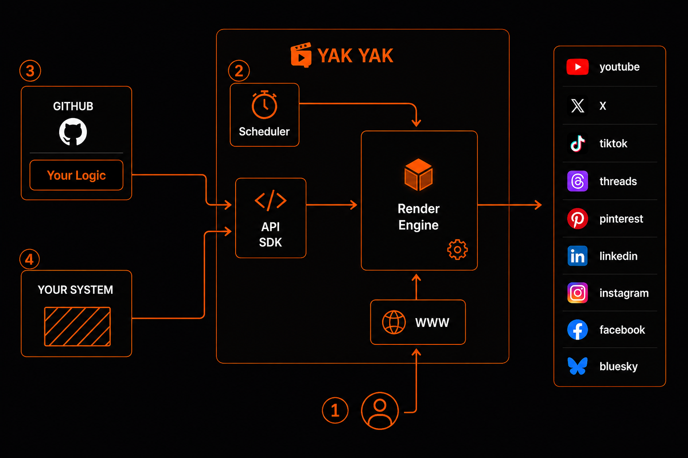

# The YakYak Cookbook 🪄 

**[YakYak](https://yakyak.ai/)** is an autonomous AI media agency: it writes, casts,
voices, renders, and ships episodic video to your social channels on auto-pilot. 
This repo is your magic wand 🪄 to create new and never seen before content, where the
sky is the limit and your imagination is your super power 🚀. Best of all, it all runs
automatically, so you can relax while your channels make 💰💰💰 for you. 



> The numbered badges are the **levels of your journey**: **①** create in the app ·
> **②** let it auto-pilot on a schedule · **③** run algorithmic shows from GitHub —
> *you are here* · **④** drive the whole pipeline from your own system and AI agents.

## 🎉 You've reached Level 3

Congratulations — you've reached **Level 3** on your journey to master YakYak, and
**this is where the real fun starts.** Levels 1 & 2 — signing up and rendering your
first movies in the app — will start to feel very simplistic the moment you begin
producing **algorithmic content** that posts itself to **all your social channels, on
a schedule you control yourself.**

That's exactly what this cookbook unlocks: recipes, client libraries, and a production
**showrunner** for driving the whole YakYak pipeline — **source → render → post** —
programmatically.

### Best way in: the shows

Start with **[`show/README.md`](show/README.md)**. Each "show" is a self-contained
channel — a premise, a recurring cast, and a way of *sourcing* each episode's story —
that runs itself on GitHub Actions. The best part: **you can play with these without
ever cloning the code to your machine.** Fork the repo, add your token as a secret,
and run a show straight from GitHub's UI. For minor tweaks you can even **edit the
files in the browser** — for many people that's all you'll ever need.

### Level 4: clone it, and bring your own AI coding agent

To create *truly* amazing content, continue to **Level 4**: clone this repo to your
local machine. That makes the **[course](course/README.md)** easier to study — but
what you probably *really* want is to point **Claude Code, Codex, or any other AI
coding tool** at this repo and let it ingest and learn from everything here as a
starting point. With the API, SDKs, course, and showrunner all at its disposal, you
can simply tell your coding assistant to build any story-telling agent you can imagine.

Copy-paste this into Claude Code / Codex to get started:

```text
I want to build my own automated AI video show using YakYak — this repo is the
YakYak Cookbook. YakYak is an API-driven service that writes, casts, voices,
renders, and auto-posts episodic video. The show/ folder is a "showrunner" that
sources a story on a schedule, renders it to a video, and publishes it to social.

Please:
1. Read README.md, docs/README.md, docs/workflows.md, show/README.md, and
   show/showrunner/README.md so you understand the model and the showrunner.
2. Help me invent a new show — a premise, a recurring cast, and a story source.
3. Scaffold it under show/<MyShow>/, using an existing show as the template
   (show/PettyCourt for a live-data "prompt" show, or show/Horoscopes for a
   deterministic "compute" show): write show.env, campaign.import.json, and the
   compute.* or prompt.md story source.
4. Walk me through running it and wiring up my YakYak token.
```

## Reference

- **Product:** https://yakyak.ai/
- **API docs (Swagger UI):** https://api.yakyak.ai/api/docs
- **OpenAPI spec (JSON):** https://api.yakyak.ai/api/docs-json

The API is organized into five resource groups: **Users** (auth & accounts),
**Workflow** (campaigns, movies, scenes, generation, rendering), **Scheduler**
(automated render triggers), **Social** (network connections & posting), and
**Data** (styles, voices, fonts). All endpoints use Bearer-JWT auth.

## Repository layout

| Folder | What's inside |
|--------|---------------|
| [`show/`](show/) | **Level 3 — start here.** Self-contained, schedule-driven channels (the *showrunner*) you can fork and run on GitHub Actions without cloning anything. |
| [`course/`](course/) | Hands-on, copy-paste course (curl · JS · Python) — from signup to a rendered, shareable movie. The Levels 1–2 foundation. |
| [`docs/`](docs/) | Concepts, glossary, and guides for the YakYak API and workflow model — including [debugging](docs/debugging.md) failing Actions and AI-generation failures. |
| [`sdk/`](sdk/) | Client libraries generated from the OpenAPI spec — [Python](sdk/python/) and [JavaScript/TypeScript](sdk/javascript/). |
| [`integrations/`](integrations/) | Connectors that let AI agents and automation tools operate YakYak — [Claude](integrations/claude/), [Codex](integrations/codex/), [n8n](integrations/n8n/). |
| [`community/`](community/) | Community-contributed campaigns and channel showcases. |

## License

See [LICENSE](LICENSE).
