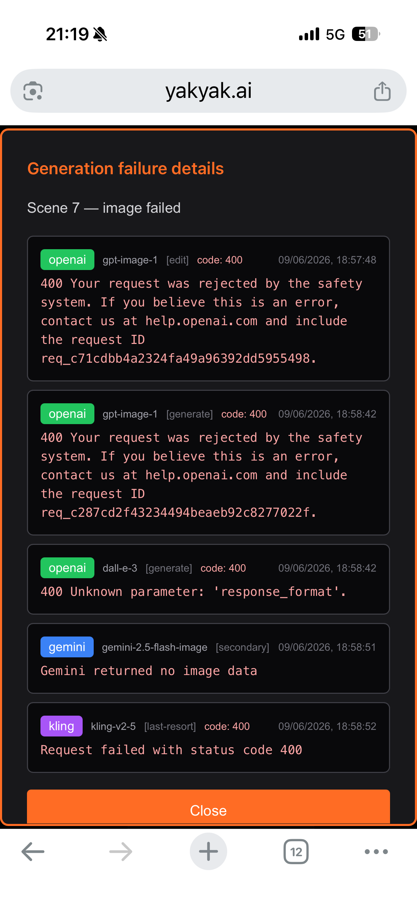

# Debugging

Two things break in a YakYak-on-auto-pilot setup, and they break in different
places:

1. **The plumbing** — the GitHub Actions that pull the showrunner images, prepare
   a story, upload, and render (`run-shows.yml`, `post-show.yml`,
   `publish-dockerhub.yml`, `publish-sdks.yml`). When these fail you get a red ✗
   in the **Actions** tab.
2. **The generation** — the AI that turns a scene into an image, animation, voice,
   or soundtrack. These don't fail the Action (a render can complete with a scene
   that fell back to a placeholder); they surface on the YakYak **`/profile`**
   page as *Generation failure details*.

This guide covers both.

> **Looking for the red "Generation failure details" pop-up** you get on a scene
> (the per-provider list of `openai` / `gemini` / `kling` attempts and their error
> codes)? Jump straight to
> [The "Generation failure details" modal](#the-generation-failure-details-modal)
> in Part 2.

**Contents**

- [Part 1 — Debugging failing GitHub Actions](#part-1--debugging-failing-github-actions)
- [Part 2 — Tracking progress & generation failures on `/profile`](#part-2--tracking-progress--generation-failures-on-profile)
  - [Watching progress](#watching-progress)
  - [**The "Generation failure details" modal**](#the-generation-failure-details-modal) ← the per-scene AI failure pop-up
  - [Diagnosing from the messages](#diagnosing-from-the-messages)
  - [Recovering a failed scene](#recovering-a-failed-scene)

---

## Part 1 — Debugging failing GitHub Actions

Everything below is standard GitHub Actions tooling; the
[official troubleshooting guide](https://docs.github.com/en/actions/how-tos/troubleshoot-workflows)
is the canonical reference. The repo-specific failure modes are at the end.

### 1. Read the run

In the browser: **Actions** tab → pick the workflow (e.g. *run-shows*) → click the
failed run → expand the failed job → expand the red step. Logs stream live and are
kept after the run.

From the terminal with the [`gh` CLI](https://cli.github.com/) (often faster):

```bash
gh run list --workflow run-shows.yml          # recent runs + status
gh run view <run-id>                           # job/step summary
gh run view <run-id> --log-failed              # only the failed steps' logs
gh run view <run-id> --job <job-id> --log      # full log for one matrix job
```

Because `run-shows` uses a **matrix** with `fail-fast: false`, one show failing
leaves the others green — open the specific matrix leg (e.g. `run (Horoscopes)`),
not the run as a whole.

### 2. Jump to the annotations

The workflows emit GitHub **workflow commands** — `::error::` and `::warning::`
lines (see `run-shows.yml`). These show up as annotations at the top of the run
summary, so you usually don't need to read the whole log. Examples you'll see from
this repo: `docker login failed after 5 attempts`, `'docker pull …' failed after
5 attempts`, `No Claude credential set`, `Failed to push story … after 5 attempts`.

### 3. Re-run — and re-run *with debug logging*

- **Re-run failed jobs** retries only the failed matrix legs (cheaper than the
  whole run).
- **Re-run all jobs / Re-run failed jobs → tick "Enable debug logging"** turns on
  verbose logging *for that one re-run only*, without touching repo settings
  ([changelog](https://github.blog/changelog/2022-05-24-github-actions-re-run-jobs-with-debug-logging/)).
  This is the fastest first move on a flaky failure.

```bash
gh run rerun <run-id> --failed                 # re-run only failed jobs
gh run rerun <run-id> --failed --debug         # …with debug logging on
```

### 4. Persistent debug logging

If a failure isn't reproducible in a single re-run, turn debug logging on at the
repo level ([GitHub docs](https://docs.github.com/en/actions/how-tos/monitor-workflows/enabling-debug-logging)).
Set these as **repository variables** (Settings → Secrets and variables → Actions
→ Variables) — they can also be secrets, and **a secret takes precedence over a
variable** of the same name:

| Name | Effect |
|------|--------|
| `ACTIONS_STEP_DEBUG` = `true` | Verbose per-step logs (the `##[debug]` lines). |
| `ACTIONS_RUNNER_DEBUG` = `true` | Adds the runner + worker process logs to the downloadable log archive. |

Remember to remove them when you're done — they make every run noisier.

### 5. Interactive SSH into the runner

For "works on my machine" failures, drop a
[`mxschmitt/action-tmate`](https://github.com/marketplace/actions/debugging-with-tmate)
step in *temporarily* to open an SSH/web-terminal session into the live runner so
you can poke at the filesystem, env, and Docker state:

```yaml
      - name: Debug via tmate
        if: ${{ failure() }}              # only when an earlier step failed
        uses: mxschmitt/action-tmate@v3
        with:
          limit-access-to-actor: true    # only you can connect
```

Remove it once you've found the cause — it holds the runner open until you
disconnect (or it times out), burning Actions minutes.

### 6. Reproduce locally

Most of what these workflows do is `docker run` against the showrunner images, so
you can usually reproduce a failure on your machine with the same command the step
runs (see the `Prepare story` / `Upload + render` steps in `run-shows.yml`). For
the YAML/event side, [`act`](https://github.com/nektos/act) runs workflows locally
in Docker — handy for matrix and trigger logic, though it can't perfectly mirror
hosted-runner images or secrets.

### Repo-specific failure modes

These are the failures already anticipated (and retried) in the workflows — if the
retries are exhausted, this is what they mean:

| Symptom in the log | Likely cause | Fix |
|--------------------|--------------|-----|
| `docker login failed after N attempts` / `context deadline exceeded` on `/v2/` | Docker Hub registry flaking, or `DOCKER_HUB_PAT` secret missing/expired | Re-run; if it persists, rotate `DOCKER_HUB_PAT`. Public images still pull anonymously (subject to rate limits). |
| `'docker pull …' failed after N attempts` | Image tag missing, or anonymous pull rate-limited | Check `SHOWRUNNER_TAG` repo variable points at a published tag; set `DOCKER_HUB_PAT` to lift the rate limit. |
| `No Claude credential set` | Neither `CLAUDE_CODE_OAUTH_TOKEN` nor `ANTHROPIC_API_KEY` secret is set (Prompt/WebFetch shows need it) | Add one of the two secrets. The OAuth token is preferred (not metered). |
| Job killed at **75 min** (`timeout-minutes`) | Scene poll or render hung | Re-run; if chronic, the render is stuck server-side — check the movie on `/profile` (Part 2). |
| `Failed to push story … after 5 attempts` | Several matrix shows racing `git push` to `main` | Usually transient (the step rebases and retries); re-run the one leg. |
| `YAKYAK_PAT` auth errors during upload/render | PAT missing or expired | Regenerate via the Users endpoints and update the `YAKYAK_PAT` secret. |

> Tip: posting to social is an explicit, irreversible opt-in (`post: true` dispatch
> input / `--post`). A render-only run that "did nothing visible" is working as
> intended — it rendered but didn't publish.

---

## Part 2 — Tracking progress & generation failures on `/profile`

The web app's **`/profile`** page (https://yakyak.ai/profile) is the human-facing
mirror of the API's progress endpoints (`get-movie-progress`,
`get-scene-progress`). It's where you watch a render move through the pipeline and,
when a scene's AI generation fails, where you get the detail you can't see from a
green ✓ in Actions.

### Watching progress

A render is the chain `summary → cast → screenplay → per-scene image → animation →
subtitles → concat → soundtrack`. On `/profile` each movie shows its current stage
and each scene its asset state. The same data is available programmatically:

```bash
# Movie-level: which execution (movieScreenplay, movieConcat, …) is running/done
GET https://api.yakyak.ai/workflow/get-movie-progress/{movieId}

# Scene-level: per-asset status (image, animation, subtitle)
GET https://api.yakyak.ai/workflow/get-scene-progress/{sceneId}
```

(Base URL has **no** `/api` prefix; all routes need a Bearer JWT.)

### The "Generation failure details" modal

> 📋 **This is the orange pop-up you see on `/profile`** — titled *Generation
> failure details*, e.g. "Scene 7 — image failed", listing each provider that was
> tried (`openai`, `gemini`, `kling`) with its error code, message, and timestamp.
> The rest of this section explains how to read it.

<p align="center">
  
</p>

When a scene's asset can't be generated, `/profile` surfaces a **Generation
failure details** panel for that scene. It exists because image/video generation
runs through a **provider fallback chain** — if the primary model refuses or errors,
YakYak automatically tries the next one, and only if *every* provider fails does the
asset fail. The modal shows the full attempt log so you can see *why* each provider
declined.

Reading the example panel (Scene 7 — image failed):

```
openai   gpt-image-1  [edit]       code: 400   …18:57:48
  400 Your request was rejected by the safety system… request ID req_c71…
openai   gpt-image-1  [generate]   code: 400   …18:58:42
  400 Your request was rejected by the safety system… request ID req_c28…
openai   dall-e-3     [generate]   code: 400   …18:58:42
  400 Unknown parameter: 'response_format'.
gemini   gemini-2.5-flash-image  [secondary]   …18:58:51
  Gemini returned no image data
kling    kling-v2-5   [last-resort]  code: 400  …18:58:52
  Request failed with status code 400
```

What each column tells you:

- **Provider + model** (`openai gpt-image-1`, `gemini …`, `kling …`) — who was
  tried.
- **Operation tag** — `[edit]` vs `[generate]` (edit an existing frame vs make a
  new one), and the **fallback rank**: `[secondary]`, `[last-resort]`. The first
  provider is the primary; the chain walks down on each failure.
- **`code`** — the upstream HTTP status (`400` here = the provider rejected the
  request).
- **Timestamp** — when that attempt ran (they're seconds apart; the whole chain
  burns through quickly).
- **Message + request ID** — the provider's own error. The `req_…` IDs are
  OpenAI request IDs you can quote to `help.openai.com`.

### Diagnosing from the messages

The message text tells you which class of failure you're in:

| Message | Meaning | What to do |
|---------|---------|------------|
| `Your request was rejected by the safety system` (400) | Content moderation refused the **prompt or the source image** — the most common cause of a fully-failed scene. | Edit the scene's `story` / `animation-prompt` to remove whatever tripped moderation, then regenerate (below). |
| `Unknown parameter: 'response_format'` (400) | A provider-API incompatibility on the YakYak side, not your content. | Not user-fixable — report it; the fallback chain should have moved past it. |
| `Gemini returned no image data` | Provider returned an empty result (often a softer moderation block). | Same as a safety rejection — adjust the prompt and retry. |
| `Request failed with status code 400` (kling) | Last-resort video provider also rejected it → the scene's asset is left unset. | Adjust the prompt; if it keeps failing across all providers, simplify the scene. |

When the cause is content, **every** provider tends to refuse the same prompt, so
re-running without changing anything just reproduces the chain. Change the input
first.

### Recovering a failed scene

After editing the offending prompt, regenerate just that asset (cheap relative to a
full re-render):

```bash
# Re-generate a single scene asset (image / animation / subtitle)
POST https://api.yakyak.ai/workflow/regen-scene-asset   { sceneId, asset: "image", … }
# or re-run the scene from a pipeline stage
POST https://api.yakyak.ai/workflow/rerun-scene         { sceneId, from: "movie" }
```

Generation is **recoverable and versioned** — `regen-scene-asset` /
`rerun-scene` retry the asset, and the `*-history` + `select-*` endpoints let you
roll an asset back to an earlier good version. Once the scene is green, re-run
`export-render` to fold it into the movie.

> In an auto-pilot setup the showrunner Action will have already completed (it
> renders whatever generated, placeholder and all). Fixing a bad scene is a
> `/profile` + API task, not an Actions re-run — see [Workflows](workflows.md) for
> the full pipeline and the regenerate/rollback endpoints.

---

## Sources

GitHub Actions debugging guidance above is drawn from public documentation:

- [Troubleshooting workflows — GitHub Docs](https://docs.github.com/en/actions/how-tos/troubleshoot-workflows)
- [Enabling debug logging — GitHub Docs](https://docs.github.com/en/actions/how-tos/monitor-workflows/enabling-debug-logging)
- [Re-run jobs with debug logging — GitHub Changelog](https://github.blog/changelog/2022-05-24-github-actions-re-run-jobs-with-debug-logging/)
- [`gh run` — GitHub CLI manual](https://cli.github.com/manual/gh_run)
- [Debugging with tmate — GitHub Marketplace](https://github.com/marketplace/actions/debugging-with-tmate)
- [act — run GitHub Actions locally](https://github.com/nektos/act)
</content>
</invoke>
