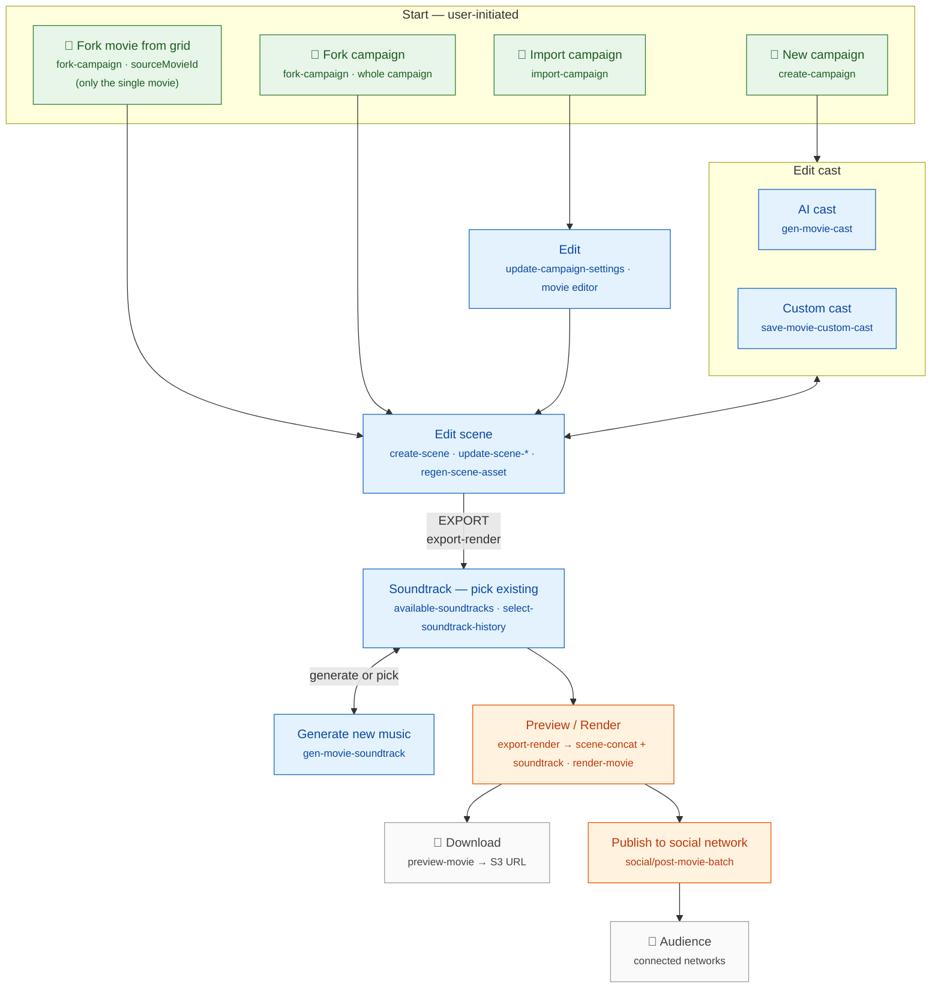

# Workflows & use cases

The end-to-end flow a user moves through in YakYak — from one of four entry points,
through authoring (cast + scenes), to soundtrack, render, and distribution.

Stages and routes below are taken from the API
(`WorkflowController` @ `workflow`, `SocialController` @ `social`); paths are served
at the **root**, e.g. `POST https://api.yakyak.ai/workflow/create-campaign`. Only the
interactive docs live under `/api` (Swagger UI at `/api/docs`).

## Stages → API routes

All `workflow/*` routes are on `WorkflowController`; `social/*` on `SocialController`.

### Entry points

| Stage | Route | Notes |
|-------|-------|-------|
| **Fork movie from grid** | `POST /workflow/fork-campaign` | Pass `sourceMovieId` → forks **only that single movie**. |
| **Fork campaign** | `POST /workflow/fork-campaign` | Omit `sourceMovieId` → deep-copies the **whole campaign**. |
| **New campaign** | `POST /workflow/create-campaign` | Then `gen-movie-summary` → cast. |
| **Import campaign** | `POST /workflow/import-campaign` | Consumes JSON from `GET /workflow/export-campaign/:campaignId`. |

### Authoring

| Stage | Route(s) |
|-------|----------|
| **Edit cast → AI cast** | `POST /workflow/gen-movie-cast` (+ `gen-movie-cast-image`, `-voice`, `-subtitle`) |
| **Edit cast → Custom cast** | `POST /workflow/save-movie-custom-cast` (+ `upload-cast-character-image`, `cast-image-history`, `select-cast-image`) |
| **Edit** (import landing) | `POST /workflow/update-campaign-settings`, `switch-campaign-mode`, movie-level `update-movie-*` |
| **Edit scene** (hub) | `create-scene`, `delete-scene`, `reorder-scenes`, `update-scene-dialogue / -title / -story / -lead-cast / -animation-prompt / -background-color`, `regen-scene-asset`, `select-scene-asset`, `get-scene-progress/:sceneId` |

`Edit cast ⇄ Edit scene` is iterative — you can move back and forth while authoring.

### Soundtrack · render · distribute

| Stage | Route(s) |
|-------|----------|
| **Export** (Scene → Soundtrack) | `POST /workflow/export-render` — change-aware; triggers `gen-movie-scene-concat` then soundtrack |
| **Soundtrack — pick existing** | `GET /workflow/available-soundtracks/:movieId`, `POST /workflow/select-soundtrack-history` |
| **Generate new music** | `POST /workflow/gen-movie-soundtrack` (+ `suggested-music-prompt`, `soundtrack-history`, `set-soundtrack`) |
| **Preview / Render** | `POST /workflow/render-movie` (full) / `export-render` (smart); `GET /workflow/get-movie-progress/:movieId` |
| **Download** | `GET /workflow/preview-movie/:movieId` returns the movie's S3 URL (public for published movies); no dedicated file endpoint |
| **Publish to social network** | `POST /social/post-movie-batch/:movieId` (or `post-movie/:movieId/:connectedNetworkId`); status via `GET /social/post-status/:movieId` |

Publishing presupposes connected networks: `POST /social/connect-network`,
`POST /social/campaign-link`, and per-campaign auto-post
(`PATCH /social/campaign-link/:campaignId/:connectedNetworkId/auto-post`).

> Transcribed from a design sketch and cross-checked against the API controllers.
> See the [model overview](README.md) for the campaign → movie → scene → cast
> objects and the full `gen-*` generation pipeline.
