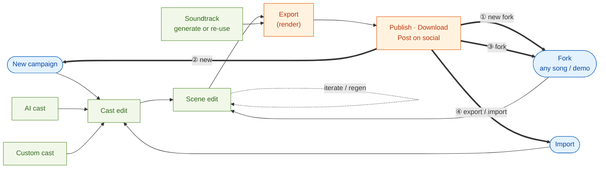

# Workflows & use cases

How a movie moves through YakYak — from an entry point, through cast and scene
editing, to render and distribution — and the handful of ways you loop a finished
movie back into the pipeline.

This is the production pipeline from [the model overview](README.md), drawn as a
flow. Boxes are stages you act on; the dotted edge is the in-place iteration loop
on a scene; the numbered bold edges are the re-entry **use cases** off a published
movie.

## The stages

| Stage | What happens | API group |
|-------|--------------|-----------|
| **New campaign** | Start a fresh channel/show with its style and settings. | Workflow — `create-campaign` |
| **Import** | Bring an existing movie/song in as the starting point. | Workflow — import / `fork-campaign` |
| **Fork (any song / demo)** | Branch off an existing or demo song to riff on it. | Workflow — `fork-campaign` |
| **Cast edit** | Define the characters — either **AI cast** (auto-generated roster, images, voices, subtitle styling) or **Custom cast** (hand-picked). | Workflow — `gen-movie-cast`, cast image/voice/subtitle |
| **Scene edit** | Build and refine the screenplay scene by scene; the **iterate / regen** loop re-runs a single scene's assets until it's right. | Workflow — `gen-movie-screenplay`, `regen-scene-asset` |
| **Soundtrack** | Generate new music or re-use an existing track. | Workflow — `gen-movie-soundtrack` |
| **Export (render)** | Render the finished movie to video. | Workflow — `render-movie`, export |
| **Publish · Download · Post on social** | Ship it: download the file, or auto-post to connected networks. | Social — `connect-network`, `post-movie-batch` |

## The four use cases

Each numbered edge is a way to start *again* from a movie you already finished:

| # | Use case | What it does |
|---|----------|--------------|
| ① | **New fork** | Fork the published movie into a brand-new branch to explore a variation. |
| ② | **New** | Start the next movie/episode fresh, reusing the campaign's look-and-feel. |
| ③ | **Fork** | Re-fork the same source again — another independent take. |
| ④ | **Export / import** | Export the rendered movie, then import it back (or into another campaign) as a new starting point. |

> Transcribed from a design sketch — this is a conceptual map of the user-facing
> flow, not a literal endpoint-by-endpoint call graph. See the
> [model overview](README.md) for the underlying campaign → movie → scene → cast
> objects and the full `gen-*` pipeline.
