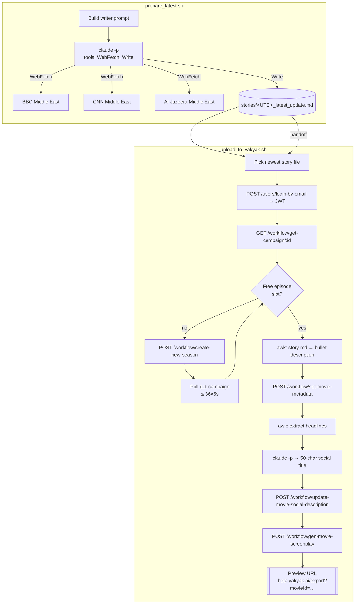
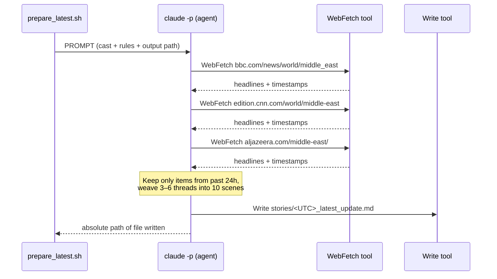
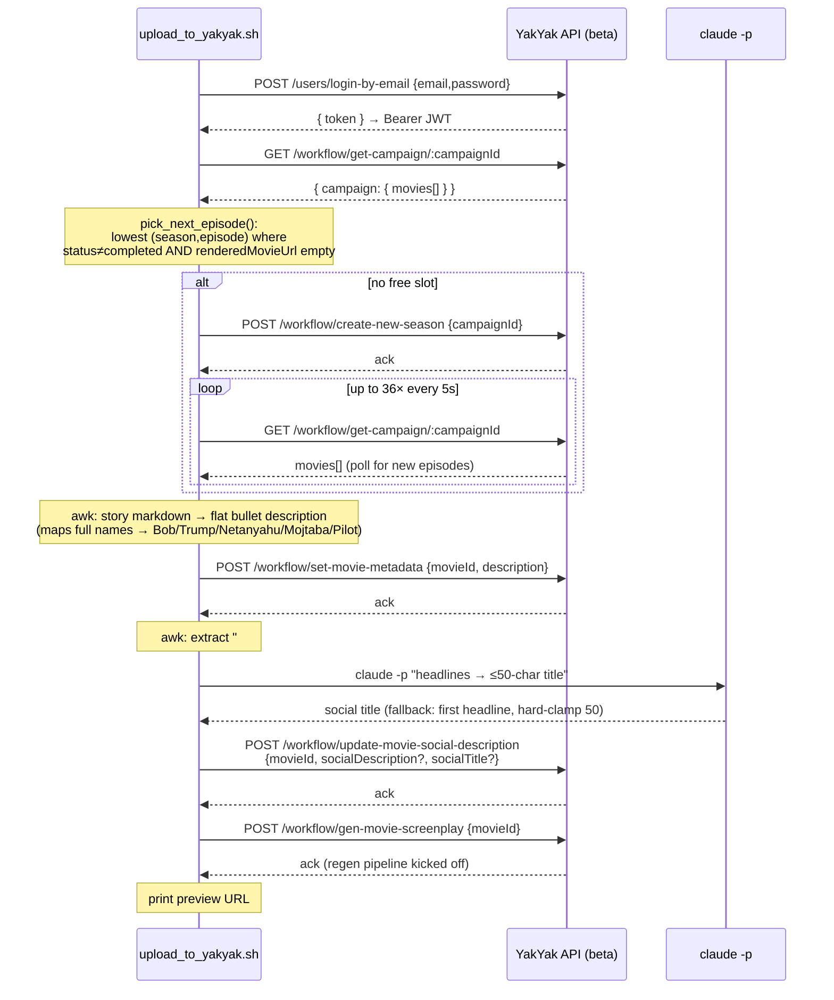

# Breaking Bricks News — How It Works

"Breaking Bricks News" (BBN) is a dark-comedy short-form video series generated
on [YakYak](https://beta.yakyak.ai). Two shell scripts in `scripts/` drive the
whole pipeline:

1. **`prepare_latest.sh`** — crawls Middle East news and writes a 10-scene story
   markdown file into `../stories/`.
2. **`upload_to_yakyak.sh`** — pushes the newest story into the next free episode
   slot of a YakYak campaign on beta and triggers the screenplay regeneration.

Both lean on the headless **Claude CLI** (`claude -p`) and the **YakYak API**.
Everything below documents the calls each script makes, the external APIs they
touch, and the end-to-end data flow.

---

## 1. End-to-end flow



---

## 2. `prepare_latest.sh` — story generation

Generates one story file per run. The only runtime dependency is the `claude`
CLI being on `PATH`.

### What it does

| Step | Action |
|------|--------|
| 1 | Compute UTC timestamp; target file `stories/<TIMESTAMP>_latest_update.md`. |
| 2 | Build a large writer prompt (cast, tone, per-scene rules, output shape). |
| 3 | Invoke `claude -p` with only **WebFetch** and **Write** tools allowed. |
| 4 | Verify the output file exists and is non-empty; otherwise exit 1. |

### The `claude -p` invocation

```bash
claude -p "$PROMPT" \
  --allowed-tools WebFetch,Write \
  --permission-mode acceptEdits \
  --add-dir "$STORIES_DIR" \
  --output-format text
```

- `--allowed-tools WebFetch,Write` — the agent may fetch URLs and write files,
  nothing else.
- `--permission-mode acceptEdits` — file writes are auto-approved (non-interactive).
- `--add-dir "$STORIES_DIR"` — grants write access to the stories directory.

### Calls made inside the agent



### External APIs / endpoints used

| Via | Target | Purpose |
|-----|--------|---------|
| WebFetch | `https://www.bbc.com/news/world/middle_east` | Top headlines, last 24h |
| WebFetch | `https://edition.cnn.com/world/middle-east` | Top headlines, last 24h |
| WebFetch | `https://www.aljazeera.com/middle-east/` | Top headlines, last 24h |
| Write | `stories/<UTC>_latest_update.md` | Persist the generated story |

Blocked fetches are tolerated: the agent notes the failure and proceeds with
whatever sources responded (see the sourcing note in the latest story file).

### Output file shape

```
# Breaking Bricks News — Latest Update
**Generated (UTC):** <TIMESTAMP>
**Sources:** BBC / CNN / Al Jazeera (Middle East), past 24h

## Headlines we drew from:
- <real event> — <source>

## Scene 1 — <title>
**Leading character:** Bob Brikko
**Dialog:** "<8–12 word line>"

<~200 words of scene prose>

... through Scene 10 (Bob Brikko again) ...
```

Cast rules: Scene 1 (cold open) and Scene 10 (sign-off) must be led by **Bob
Brikko**; exactly one spoken line per scene, attributed to the scene's leading
character. Only the fixed cast may speak.

---

## 3. `upload_to_yakyak.sh` — push to YakYak

Pushes the newest story into a YakYak campaign on beta. Requires `curl` and `jq`
(no Chrome at runtime). `claude` is optional — used only to generate the social
title, with a headline fallback if it's absent.

### Inputs

```bash
./upload_to_yakyak.sh [campaignId] [storyFile]
```

| Arg / env | Default | Meaning |
|-----------|---------|---------|
| `$1` campaignId | `62c9e486-2a80-49dd-afeb-5c5dba416cb9` | BBN production campaign |
| `$2` storyFile | newest `*_latest_update.md` | Story to upload |
| `YAKYAK_BB_EMAIL` | `bb@yakyak.ai` | Login email (from `e2e/.env.bb`) |
| `YAKYAK_BB_PASSWORD` | — (required) | Login password (from `e2e/.env.bb`) |
| `YAKYAK_API_URL` | `https://api.beta.yakyak.ai` | API base URL |

Credentials are sourced from `<repo-root>/e2e/.env.bb`.

### The call sequence



### YakYak API endpoints used

| Method & path | Body | Purpose | Controller |
|---------------|------|---------|------------|
| `POST /users/login-by-email` | `{email, password}` | Obtain JWT (`.token`) | `users.controller.ts:125` |
| `GET /workflow/get-campaign/:campaignId` | — | Fetch campaign + `movies[]` | `workflow.controller.ts:615` |
| `POST /workflow/create-new-season` | `{campaignId}` | Create the next season's episodes when none are free | `workflow.controller.ts:630` |
| `POST /workflow/set-movie-metadata` | `{movieId, description}` | Set the scene-bullet story body | `workflow.controller.ts:848` |
| `POST /workflow/update-movie-social-description` | `{movieId, socialDescription?, socialTitle?}` | Social caption + ≤50-char title | `workflow.controller.ts:768` |
| `POST /workflow/gen-movie-screenplay` | `{movieId}` | Trigger screenplay regeneration | `workflow.controller.ts:227` |

All requests after login send `Authorization: Bearer <token>` and
`Content-Type: application/json`. Bodies are built with `jq -nc` to keep them
safely escaped.

### Episode selection logic (`pick_next_episode`)

```
movies[]
  | filter: status != "completed"
  | filter: (renderedMovieUrl // "") == ""
  | sort_by(season, episode)
  | first
  → "<movieId>|<season>|<episode>|<title>"  (or "" if none)
```

If the result is empty, the script creates a new season and polls
`get-campaign` (up to ~3 minutes) until episodes appear.

### Story-markdown → description transform (`awk`)

The markdown story is collapsed into the flat bullet shape the YakYak
screenplay generator expects (matching what the UI POSTs). Everything before the
first `## Scene N` header (H1, headlines list) is dropped; each scene's prose is
flattened to one line and suffixed with the speaker line:

```
- <scene 1 prose one line> Bob says: "<dialog>"

  - <scene 2 prose one line> Trump says: "<dialog>"

  - <scene 3 prose one line> Mojtaba says: "<dialog>"
  …
```

Leading-character full names are mapped to the short aliases the generator uses:

| Markdown name contains | Alias |
|------------------------|-------|
| `Bob` | `Bob` |
| `Trump` | `Trump` |
| `Netanyahu` | `Netanyahu` |
| `Mojtaba` / `Khamenei` | `Mojtaba` |
| `Pilot` | `Pilot` |
| (other) | first word of the name |

### Social title generation

The `## Headlines` section is extracted two ways: the full caption (kept as
`socialDescription`) and the bullet-only text (fed to the LLM). The title call:

```bash
claude -p "$TITLE_PROMPT" --allowed-tools "" --output-format text
```

- `--allowed-tools ""` — pure text completion, no tools.
- Output is stripped of wrapping quotes/backticks and reduced to the first
  non-empty line.
- **Fallbacks:** on failure or empty output, use the first headline bullet.
- **Hard clamp:** if > 50 chars, truncate (multibyte-safe via `python3`, byte
  cut otherwise).

---

## 4. External APIs at a glance

| API | Used by | Auth | Calls |
|-----|---------|------|-------|
| **Claude CLI** (`claude -p`) | both scripts | local CLI | Story writing (WebFetch+Write); social title (no tools) |
| **WebFetch** (inside Claude) | `prepare_latest.sh` | none | BBC, CNN, Al Jazeera Middle East feeds |
| **YakYak API** (`api.beta.yakyak.ai`) | `upload_to_yakyak.sh` | Bearer JWT | login, get-campaign, create-new-season, set-movie-metadata, update-movie-social-description, gen-movie-screenplay |

## 5. Running it

```bash
# 1. Generate today's story
./scripts/prepare_latest.sh
#    → writes stories/<UTC>_latest_update.md

# 2. Push it to the next free episode of the BBN campaign on beta
./scripts/upload_to_yakyak.sh
#    → prints preview: https://beta.yakyak.ai/export?movieId=<id>
```

Prerequisites: `claude` on PATH (both scripts); `curl` + `jq` (upload);
`<repo-root>/e2e/.env.bb` with `YAKYAK_BB_PASSWORD` set.
