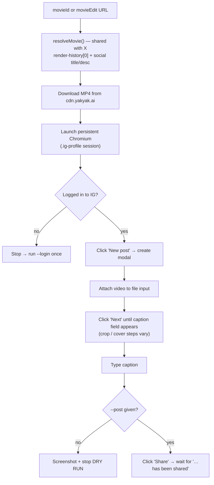

# Breaking Bricks News — Posting an Episode to Instagram

Once an episode is rendered on [YakYak](https://beta.yakyak.ai), it can be
published to Instagram as a **reel** by a reusable Playwright script,
**`e2e/src/post-to-instagram.ts`** (run via `npm run post-ig`). It mirrors the X
poster (`posting_to_x.md`) and shares the same YakYak-side movie resolver.

## Why a browser instead of curl

Instagram's reel-publishing API is three internal calls —
`rupload_igvideo` (video) → `rupload_igphoto` (cover) → `media/configure_to_clips/`
(caption + publish). Replaying them with `curl` is **very** fragile: the write
calls need a per-session `x-ig-www-claim`, a rotating `x-instagram-ajax` rollout
hash (changes on every IG deploy), `x-web-session-id`, and a `jazoest` body
checksum — all generated by IG's JavaScript. Driving the real create modal lets
IG's own client compute them and run the chunked upload, so that whole fragile
surface disappears. We only: *Create → attach video → Next… → caption → Share.*

The YakYak side stays API-driven and is **shared** with the X poster
(`e2e/src/social-common.ts`): log in by email → fetch the most-recent render →
download the MP4.

---

## 1. End-to-end flow



**Caption:** by default it is `"<social title>\n\n<social description>"` from the
movie's `socialTitle` / `socialDescription` (the same source as the X post). It is
**not** shortened — Instagram allows 2,200 characters — and is only clamped if it
somehow exceeds that. Pass `--caption-override` to supply exact text.

**Most-recent render:** identical to the X poster — the video comes from
`render-history[0]` (authoritative latest) when YakYak creds are present,
otherwise the public `preview-movie.finalMovieUrl` fallback.

---

## 2. Setup

```bash
cd e2e
npm install                 # if not already done
npm run install:browsers    # installs Chromium for Playwright
```

IG authentication lives in a **separate persistent Chromium profile**
(`e2e/.ig-profile`, gitignored — distinct from the X profile). Log in once:

```bash
npm run post-ig -- --login
```

This opens a real browser window; sign in to the **breakingbricksmedia** account,
then it saves the session and exits.

---

## 3. Usage

```bash
cd e2e

# DRY RUN — walks the create modal to the caption screen and screenshots it,
# but never publishes. ALWAYS do this first (see the caveat below).
npm run post-ig -- "https://beta.yakyak.ai/movieEdit?movieId=b8ce66d9-..." --headful

# PUBLISH (default social copy)
npm run post-ig -- "https://beta.yakyak.ai/movieEdit?movieId=b8ce66d9-..." --post

# PUBLISH with a custom caption
npm run post-ig -- "https://beta.yakyak.ai/movieEdit?movieId=b8ce66d9-..." \
  --caption-override $'My headline\n\nMy caption' \
  --post
```

You can pass either a bare `movieId` (UUID) or a full `movieEdit?movieId=…` URL.

### Options

| Flag                     | Effect                                                                          |
| ------------------------ | ------------------------------------------------------------------------------- |
| `--caption-override "…"` | Use this exact caption instead of the social title/description. Newlines via `$'…'`. |
| `--post` / `-y`          | Actually click Share. Without it the run is a **dry run**.                        |
| `--headful`              | Show the browser (recommended for IG — see notes).                              |
| `--login`                | One-time interactive login to the IG profile, then exit.                         |

### Environment (`e2e/.env.test`)

| Var                                          | Purpose                                                       |
| -------------------------------------------- | ------------------------------------------------------------- |
| `YAKYAK_TEST_EMAIL` / `YAKYAK_TEST_PASSWORD` | YakYak login (render-history latest + social title/description). |
| `YAKYAK_API_URL`                             | API base (default `https://api.beta.yakyak.ai`).              |
| `IG_PROFILE_DIR`                             | Persistent Chromium profile dir (default `e2e/.ig-profile`).  |

---

## 4. Notes & troubleshooting

- **Instagram is more brittle than X.** Its create modal has **no stable test
  ids** — the script keys off text/aria labels (`New post`, `Next`, `Share`,
  `Write a caption…`), which IG changes more often than X's `data-testid`s. If a
  run can't find a button, those labels are the first thing to check (in
  `SEL` / the `clickButton` calls in `post-to-instagram.ts`).
- **Always dry-run with `--headful` first.** The dry run screenshots the composed
  post so you can confirm the caption and — importantly — the **crop**. IG may
  default-crop a tall (9:16) video; if the screenshot looks cropped wrong, post
  that one manually or ask for aspect-ratio handling to be added.
- **"Not logged in to Instagram"** → run `npm run post-ig -- --login` once. IG
  sessions expire more aggressively than X; expect to re-login periodically.
- **Variable modal steps:** the script clicks `Next` up to 4 times until the
  caption field appears, so it tolerates IG adding/removing crop/cover/edit
  screens.
