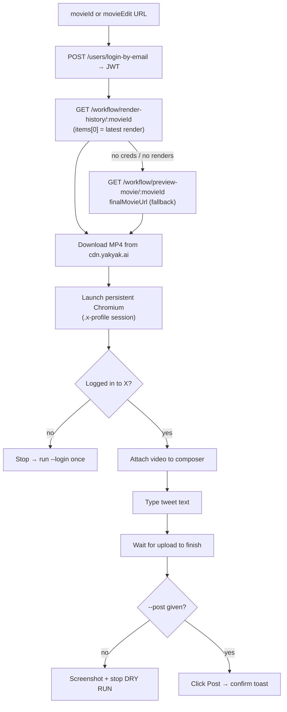

# Breaking Bricks News — Posting an Episode to X

Once an episode is rendered on [YakYak](https://yakyak.ai), the last step is
publishing it to X (Twitter) as a video tweet. That is handled by a reusable
Playwright script, **`e2e/src/post-to-x.ts`** (run via `npm run post-x`).

## Why a browser instead of curl

X's internal posting API requires a per-request `x-client-transaction-id`, a
rotating GraphQL `queryId`, and the web Bearer — all generated by X's own
JavaScript at runtime. A pure `curl`/HAR-replay script is fragile because it has
to fake those. Driving the **real x.com composer** in a browser lets X's client
compute them, so the whole fragile surface collapses to: *attach video → type
text → click Post.*

The YakYak side stays API-driven (robust): log in by email → fetch the **most
recent render** → download the MP4.

---

## 1. End-to-end flow



**Most-recent render:** the authoritative latest video is
`GET /workflow/render-history/:movieId` → `items[0].soundtrackedMovieUrl`
(ordered newest first; requires the YakYak JWT). `preview-movie.finalMovieUrl`
is only the *currently-selected* render — usually but not always the latest,
since the export-page render cycler can repoint it — so it is a no-auth fallback,
not the source of truth.

**Tweet text:** by default it is built from the movie's social copy as
`"<social title>\n\n<social description>"` — i.e. `socialTitle` (falling back to
the movie title) then a blank line then `socialDescription` (falling back to the
movie description), read from `GET /workflow/get-movie/:movieId`. The description
is shortened on a word boundary (with an ellipsis) so the whole tweet fits the
**280-character hard cap**, measured with X's own weighted count (most characters
weigh 1, but CJK / emoji / symbols weigh 2). Multi-codepoint emoji (e.g. ZWJ
sequences) are intentionally over-counted so the result never exceeds the real
limit. Pass `--text-override` to supply exact text instead (not auto-shortened).

---

## 2. Setup

The script lives in the `e2e/` package (Playwright is already configured there).

```bash
cd e2e
npm install                 # if not already done
npm run install:browsers    # installs Chromium for Playwright
```

X authentication lives in a **persistent Chromium profile** (`e2e/.x-profile`,
gitignored). Log in once — this opens a real browser window; sign in to the
`@BBricksMedia` account manually, then it saves the session and exits:

```bash
npm run post-x -- --login
```

After that, normal runs are automated until the session expires.

---

## 3. Usage

```bash
cd e2e

# DRY RUN — composes the tweet from the movie's social title/description
# (shortened to 280 chars), attaches the video, screenshots it, but never posts.
# Always do this first.
npm run post-x -- "https://yakyak.ai/movieEdit?movieId=b8ce66d9-..."

# PUBLISH (default social copy)
npm run post-x -- "https://yakyak.ai/movieEdit?movieId=b8ce66d9-..." --post

# PUBLISH with custom text instead of the social copy
npm run post-x -- "https://yakyak.ai/movieEdit?movieId=b8ce66d9-..." \
  --text-override $'My own headline\n\nMy own description' \
  --post
```

You can pass either a bare `movieId` (UUID) or a full `movieEdit?movieId=…` URL.

### Options

| Flag                  | Effect                                                                                      |
| --------------------- | ------------------------------------------------------------------------------------------- |
| `--text-override "…"` | Use this exact text instead of the social title/description. Supports newlines via `$'…'`. Not auto-shortened. |
| `--post` / `-y`       | Actually click Post. Without it the run is a **dry run**.                                    |
| `--headful`           | Show the browser (default headless for normal runs).                                        |
| `--login`             | One-time interactive login to the X profile, then exit.                                     |

### Environment (`e2e/.env.test`)

| Var                                       | Purpose                                                       |
| ----------------------------------------- | ------------------------------------------------------------- |
| `YAKYAK_TEST_EMAIL` / `YAKYAK_TEST_PASSWORD` | YakYak login, used to read `render-history` (latest render) and `get-movie` (social title/description). |
| `YAKYAK_API_URL`                          | API base (default `https://api.yakyak.ai`).              |
| `X_PROFILE_DIR`                           | Persistent Chromium profile dir (default `e2e/.x-profile`).   |

Without YakYak creds the script still works but degrades to the public
`preview-movie` endpoint: it uses `finalMovieUrl` (currently-selected render,
not necessarily the latest) and the movie title only (no social description).
For the full default tweet text, creds are required — or pass `--text-override`.

---

## 4. Notes & troubleshooting

- **Always dry-run first.** The dry run writes a screenshot of the composed tweet
  (path printed to stdout) so you can eyeball the text + video before `--post`.
- **"Not logged in to X"** → run `npm run post-x -- --login` once.
- **Selectors:** the script targets X's stable `data-testid` attributes
  (`tweetTextarea_0`, `fileInput`, `tweetButtonInline`, `attachments`, `toast`).
  If X changes the composer markup, the upload-wait or Post-click steps are where
  it would break first; update the `SEL` map in `post-to-x.ts`.
- **Upload wait:** the script waits until the media attachment is present, no
  upload progressbar remains, and the Post button is enabled (X keeps it disabled
  while a video is still uploading). Video processing can take up to ~3 minutes.
