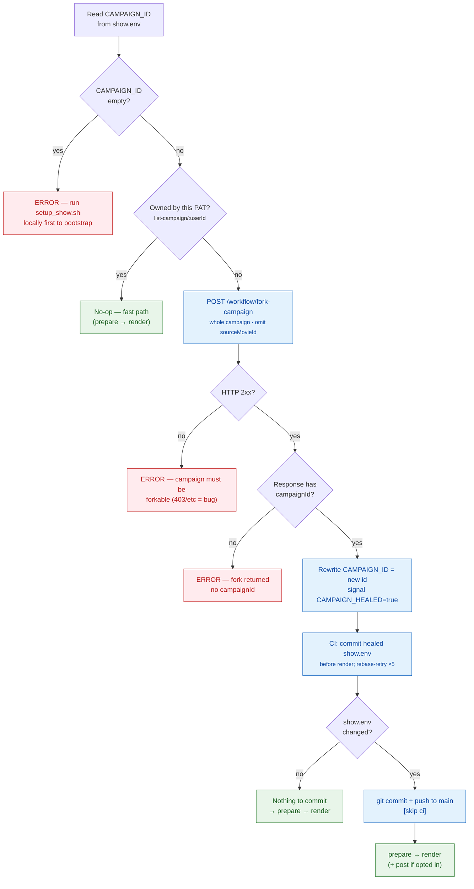

# show

Production **showrunner** for [YakYak](https://yakyak.ai/) channels, plus a gallery
of example shows. Each show is a self-contained channel — a campaign, a recurring
cast, and a way of *sourcing* each episode's story — wired to run on auto-pilot:
**source → render → (optionally) post**.

The shared engine lives in [`showrunner/`](showrunner/) and is **show-agnostic** —
every show is just a `show.env` + a story source. CI runs them via the **Render
Shows** workflow (`.github/workflows/run-shows.yml`, generates + renders the due
shows, render-only by default) and **Post Episode** (`post-show.yml`, publishes one
already-rendered episode). See [`showrunner/README.md`](showrunner/README.md) for
the full config key reference and [`../docs/`](../docs/) for the campaign → movie →
scene model.

## How a show is sourced

The interesting axis these examples demonstrate is **where each episode's story
comes from** — set per show by `PREPARE_KIND` and whether it `REQUIRES_MODEL`:

- **Computed** — a deterministic `compute.py`/`compute.js` derives the story from
  the date/week alone. No model, no API key, fully offline and reproducible.
- **Extracted** — the story is pulled from a baked **public-domain** corpus
  (historical facts, classic texts), walked by date or by a cursor.
- **Prompt / WebFetch** — `prompt.md` drives `claude -p` to fetch **live** data
  (prices, headlines, social posts) and write the story.

A show can combine these (e.g. *computed date → extracted corpus → model
dramatization*). Engines come in three ports — `py`, `js`, `sh` — and produce
identical results, demonstrating engine parity.

### Animation: Kling vs Ken Burns

Each show's campaign (`campaign.import.json`, the source of truth) renders its scenes
with **Kling** — YakYak's AI video generation — for full motion. While you're still
**refining a channel** (iterating on the cast, script, or look), you can switch a
campaign's `animationType` to **Ken Burns** — a pan-and-zoom over the still image —
which renders **faster and cheaper**, so each iteration costs less. Switch back to
Kling for the finished episodes.

## The shows

Ordered roughly simplest → most involved:

| Show | Sourcing | Engine | Model? | Cadence | What it demonstrates |
|------|----------|--------|:------:|---------|----------------------|
| [`Horoscopes/`](Horoscopes/) | Computed | py | no | weekly | Fully **deterministic & offline** sourcing — story from the ISO week in `compute.py`, no model/API key. Single shared narrator voice. Proves the engine is show-agnostic. |
| [`LuckyDay/`](LuckyDay/) | Computed | py | no | daily | **Localization** — the first non-English show: Mandarin voice (Mr. Chen) with brush-calligraphy Chinese subtitles, story computed deterministically from the date. |
| [`SunTzuToday/`](SunTzuToday/) | Extracted + model | js | yes | mwf | **Sequential extraction** — walks one *verbatim* maxim per episode from a public-domain corpus (Art of War, Project Gutenberg) via a cursor, dramatized as a modern micro-drama. |
| [`OnThisDay/`](OnThisDay/) | Computed + Extracted + model | js | yes | daily | **Computed-date → public-domain corpus → model**: picks the day's anniversary and stages a reenactment hosted by The Chronicler. Rotating historical guests (`allowNewCharacters`), 16:9. **Also the worked example of the content-moderation failure path — see below.** |
| [`DailyPull/`](DailyPull/) | Computed (seeded) + model | js | yes | daily | **Deterministic randomness** — a date-seeded RNG draws a 3-card tarot spread in `compute.js` (same day → same draw, last 7 excluded), then `claude -p` dramatizes it. 23-card recurring cast. |
| [`MarketMayhem/`](MarketMayhem/) | Prompt / WebFetch + model | py | yes | daily | **Live market data** — fetches the day's Binance 24h prices + the Fear & Greed index, dramatized by personified assets (Bitcoin, the Fed, …) with distinct voices. |
| [`PettyCourt/`](PettyCourt/) | Prompt / WebFetch + model | py | yes | daily | **Live UGC, transformed** — fetches top drama-subreddit posts via Reddit's public JSON, *paraphrases* them (transformative + SFW, never verbatim), and stages a courtroom sitcom. Upvotes act as a built-in virality pre-screen. |
| [`BreakingBricksNews/`](BreakingBricksNews/) | Prompt / WebFetch + model | py | yes | daily | Flagship **satirical brick-built news** — `prompt.md` drives `claude -p` to turn the day's real headlines into a brick-world newscast with a recurring anchor cast, auto-posted to social. |

## How to run a show

The showrunner runs as a **GitHub Actions workflow in your own fork** of this repo.
You don't clone anything or run servers — you fork, drop in one secret, and trigger a
run (by hand or on a daily cron). Each run does **source → render → (optionally)
post**, and a self-heal step makes sure the campaign it renders into is owned by
*your* token. The five steps below take you from zero to a published episode.

### 1. Fork the repo

Click **Fork** on GitHub to get your own copy — it comes with the shows, the
[`showrunner/`](showrunner/) engine, and the `.github/workflows/` that drive them.
**New forks have Actions disabled**, so enable them in the fork's **Actions** tab
before anything will run. Full walkthrough — private-vs-public, enabling Actions, the
cron-on-forks caveats, and keeping your fork in sync — in
[**`../docs/github-forking.md`**](../docs/github-forking.md).

> This is GitHub-*repo* forking. It's distinct from YakYak *campaign* forking, which
> the run itself uses in step 4 — see [`../docs/forking.md`](../docs/forking.md).

### 2. Add your YakYak PAT as a repo secret

The run authenticates to the YakYak API with a **personal access token** (`yy_live_…`),
minted at **yakyak.ai/profile**. Add it to your fork under **Settings → Secrets and
variables → Actions** as a secret named exactly **`YAKYAK_PAT`** — that one secret is
enough to **render**. Two optional extras: a **model** credential
(`ANTHROPIC_API_KEY` or `CLAUDE_CODE_OAUTH_TOKEN`) for the *prompt/WebFetch* shows
that write their story with a model, and the **`social_publishing`** PAT scope if
you'll post. Step-by-step (minting the token, the token-balance gate, every optional
secret) in [**`../docs/yakyak-pat-and-secrets.md`**](../docs/yakyak-pat-and-secrets.md).

### 3. Run it (dispatch or cron)

**On demand (dispatch).** In the fork's **Actions → Render Shows → Run workflow**:
- **`show`** — one show's basename (e.g. `Horoscopes`) to run just that one *now*
  (this **forces** it, ignoring its cadence and `ENABLED`); blank = all due shows.
- **`post`** — check it to **also publish** this run to social. **Irreversible**, so
  it's off by default; leave it unchecked to render only.

**On a schedule (cron).** `run-shows.yml` ticks once daily at **06:50 UTC**; the
planner then runs whichever shows are **due** that day. Each show sets its own rhythm
and posting posture in its `show.env`:
- **`CADENCE`** — `daily` (default) / `weekly` (Sundays) / `mwf` (Mon-Wed-Fri).
- **`ENABLED="false"`** — skip this show on scheduled runs (manual dispatch still
  forces it).
- **`POST="true"`** — publish on every scheduled run (default render-only).

How to change the cron line, the UTC/granularity/forks caveats, and the `ENABLED` /
`POST` flags in detail are in [**`../docs/scheduling.md`**](../docs/scheduling.md);
the underlying trigger is GitHub's
[scheduled-workflow `cron`](https://docs.github.com/en/actions/using-workflows/events-that-trigger-workflows#schedule).

### 4. The fork-heal step (owned, or fork)

So you never have to touch `campaign.import.json` or run a paid setup, the run starts
with a **self-heal** step (`showrunner/ensure_owned_campaign.sh`): it checks whether
the `CAMPAIGN_ID` committed in `show.env` is **owned by your PAT**. If it is, it
no-ops. If not (the cookbook ships ids owned by the YakYak demo account), it **forks
that campaign** — instant, reuses the already-rendered cast/soundtrack, **zero
tokens** — rewrites `CAMPAIGN_ID` to the new fork, and **commits it back to your fork
before the expensive render** so the next run sees an owned id and skips straight to
the fast path.

The id is committed **before** rendering on purpose: if a run forked and then died
mid-render, a later run would otherwise see the old un-owned id and fork *again*,
leaving an orphan. Importing a *fresh* campaign from `campaign.import.json` (paid,
re-renders everything) is the **manual** path (`showrunner/setup_show.sh`) and is
deliberately **not** used here — the automated path only ever *forks*. The full *why*
of fork semantics (and why asset URLs keep the source campaign's id) is in
[`../docs/forking.md`](../docs/forking.md).

### 5. `campaign.import.json` — export / import

Every show ships a **`campaign.import.json`**: the portable definition of its
campaign and recurring cast, with **no rendered assets**. It's the JSON returned by
the API's `GET /workflow/export-campaign/:campaignId` and consumed by
`POST /workflow/import-campaign` — YakYak's **export/import** mechanism for moving a
campaign's *recipe* between accounts reproducibly. Each file carries:

- **Campaign settings** — `name`, `prompt`, `aspectRatio` (`9:16` / `16:9` / `1:1`),
  `animationType`, `imageQuality`, `mode`, `subtitleMode`, and crucially
  `allowNewCharacters` (`false` = fixed recurring cast; `true` = new faces per
  episode) and the **`style`** (`label` + `description`, appended to every image
  prompt — the art direction).
- **The cast roster** — under each template movie's `customCast` / `cast`: every
  character's `name`, `description` (the portrait prompt), assigned voice, and
  subtitle font/color.

**Export vs. import, and where it fits the four entry points:** *import* **regenerates**
the cast portraits and soundtrack from the recipe — it's **paid** and the basis of
`setup_show.sh` (the one-time, human-gated bootstrap). *Forking* (step 4) instead
**reuses** already-rendered assets — free and instant — which is why CI prefers it.
Import is the reproducible-from-source path; fork is the cheap-copy path. The two,
plus *new campaign* (from scratch) and *fork movie* (one episode), are the four ways
to start a campaign — laid out in [`../docs/workflows.md`](../docs/workflows.md) and
compared in [`../docs/forking.md`](../docs/forking.md#fork-vs-the-other-entry-points).

> For the **local** (no-CI) version of all this — drive the three scripts from your
> own checkout — see [`showrunner/FORKING.md`](showrunner/FORKING.md). The full
> `show.env` key reference is in [`showrunner/README.md`](showrunner/README.md).

## Known intentional failure: OnThisDay

**OnThisDay is intentionally kept as the worked example of the content-moderation
failure path.** Its dramatized history routinely names real people, brands, and
other **IP-protected entities** — and the image/video models' safety systems reject
prompts that mention them. Because YakYak walks a **provider fallback chain**, a
rejected prompt tends to be refused by *every* provider, so the affected scenes (and
sometimes a whole episode) fail rather than render.

This is expected, not a bug in the showrunner — it's here so you can see what a
moderation rejection looks like end-to-end and how to recover it (edit the offending
scene `story`/`animation-prompt` to drop the protected name, then regenerate the
single asset). For the full walkthrough — reading the *Generation failure details*
panel, the `Your request was rejected by the safety system` (400) signal, and the
`regen-scene-asset` / `rerun-scene` recovery — see
[**`../docs/debugging.md`**](../docs/debugging.md#the-generation-failure-details-modal).

## Reference

- **Run a show (this fork):** [`../docs/github-forking.md`](../docs/github-forking.md) · [`../docs/yakyak-pat-and-secrets.md`](../docs/yakyak-pat-and-secrets.md) · [`../docs/scheduling.md`](../docs/scheduling.md)
- **Showrunner config & engine:** [`showrunner/README.md`](showrunner/README.md) · **Local (no-CI) path:** [`showrunner/FORKING.md`](showrunner/FORKING.md)
- **Pipeline & model:** [`../docs/`](../docs/) · **Forking (campaigns):** [`../docs/forking.md`](../docs/forking.md) · **Debugging:** [`../docs/debugging.md`](../docs/debugging.md)
- **Product:** https://yakyak.ai/ · **API docs:** https://api.yakyak.ai/api/docs
